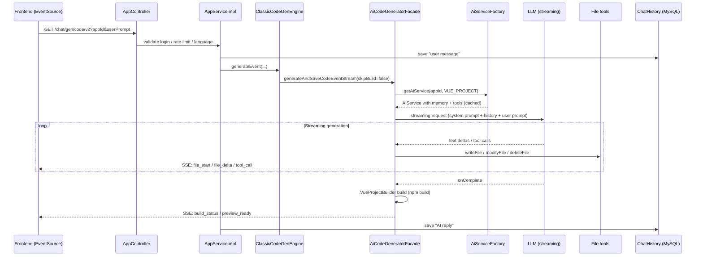

# AI Code Backend (AI App Code-Generation Platform · Backend)

An AI-powered application code-generation platform backend built with **Spring Boot 3.5 + LangChain4j + LangGraph4j**. A user describes what they want in plain language, and the platform automatically **plans → routes → generates → validates → builds → deploys** a runnable website/app, streaming the whole generation process back in real time over SSE.

> Similar to "bolt.new / v0": type a prompt and the AI generates an HTML single page, a native multi-file project, or a complete Vue project — live.

> 🌐 中文版见 [README.md](README.md)

---

## Table of Contents

- [Key Features](#key-features)
- [Tech Stack](#tech-stack)
- [⭐ End-to-End AI Generation Flow](#-end-to-end-ai-generation-flow)
- [Two Generation Modes](#two-generation-modes-classic-vs-workflow)
- [Three Code Generation Types](#three-code-generation-types)
- [Core Components](#core-components)
- [Getting Started](#getting-started)
- [Main Endpoints](#main-endpoints)
- [Project Structure](#project-structure)

---

## Key Features

- 🤖 **Generate apps from natural language**: produce HTML / multi-file / Vue projects from a single sentence, fully streamed over SSE.
- 🧭 **Smart routing**: the AI decides both the *generation type* (HTML / multi-file / Vue) and the *generation mode* (classic / workflow).
- 🔧 **Tool use**: in Vue project mode the AI manipulates the filesystem itself via `writeFile / modifyFile / deleteFile / readFile` tools.
- 🕸️ **LangGraph4j workflow orchestration**: image collection → prompt enhancement → code generation → quality check (auto-retry on failure) → project build.
- 🖼️ **Automatic asset collection**: collects assets in parallel from Pexels (photos), unDraw (illustrations), Logo.dev (logos), and Mermaid (diagrams), then injects them into the prompt.
- ✅ **AI code-quality check**: after generation, the AI reviews the code; if it fails, it loops back and regenerates with the error context.
- 🚀 **One-click deploy + auto screenshot**: build output is deployed as a reachable site; a Selenium screenshot is taken asynchronously and uploaded to R2 as the cover image.
- 💬 **Multi-turn conversation memory**: Redis-backed chat memory isolated per `appId`, enabling continuous iteration on a generated app.
- 🛡️ **Safety & rate limiting**: input safety guardrails, Redisson distributed rate limiting, and `@AuthCheck` permission checks.
- 🌍 **Multilingual**: the AI adapts its output language (Chinese / English) to the user's input.

---

## Tech Stack

| Category | Technology |
| --- | --- |
| Framework | Spring Boot 3.5.13, Java 25 |
| AI orchestration | LangChain4j 1.13, LangGraph4j 1.8 (workflow graph) |
| LLM | OpenAI-compatible protocol (defaults to DeepSeek / Gemini, configurable) |
| Streaming | Reactor `Flux` + Server-Sent Events (SSE) |
| Persistence | MySQL + MyBatis-Flex |
| Cache / session / memory | Redis (Spring Session, chat memory), Caffeine (AiService instance cache) |
| Rate limit / lock | Redisson |
| Object storage | Cloudflare R2 (AWS S3 SDK) |
| Screenshots | Selenium + WebDriverManager |
| API docs | Knife4j (OpenAPI 3) |

---

## ⭐ End-to-End AI Generation Flow

> This is the platform's core path: from "user sends a prompt" to "code is generated, persisted to disk, and streamed back to the frontend".

```mermaid
flowchart TD
    A([User sends prompt<br/>GET /app/chat/gen/code/v2]) --> B[AppController<br/>auth / rate limit / language detection]
    B --> C[AppServiceImpl.chatToGenCodeV2<br/>load App, save user message to history]
    C --> D{Select generation mode<br/>AiCodeGenModeRoutingService}
    D -->|classic| E[ClassicCodeGenEngine]
    D -->|workflow| F[WorkflowCodeGenEngine]

    %% ---------- Classic mode ----------
    E --> G[AiCodeGeneratorFacade<br/>dispatch by generation type]
    G --> H[AiCodeGenerateServiceFactory<br/>get/create memory-backed AiService<br/>Caffeine cache + Redis memory]
    H --> I{Code generation type}
    I -->|HTML / MULTI_FILE| J[Streaming text<br/>FileBlockStreamParser parses file blocks]
    I -->|VUE_PROJECT| K[TokenStream + tool use<br/>writeFile/modifyFile/deleteFile]

    %% ---------- Workflow mode ----------
    F --> L[CodeGenWorkflow<br/>LangGraph4j graph execution]
    L --> M[ImageCollectorNode<br/>collect image assets in parallel]
    M --> N[PromptEnhancerNode<br/>inject assets, enhance prompt]
    N --> O[RouterNode<br/>AI decides generation type]
    O --> P[CodeGeneratorNode<br/>call Facade to generate<br/>skipBuild=true]
    P --> Q[CodeQualityCheckNode<br/>AI code-quality check]
    Q -->|fail| P
    Q -->|HTML/multi-file skip_build| END1
    Q -->|Vue build| R[ProjectBuilderNode<br/>npm install & npm run build]
    R --> END1

    %% ---------- Converge: persist & stream ----------
    J --> S[AppFileService<br/>write to CODE_OUTPUT/{type}_{appId}/]
    K --> S
    END1 --> S
    S --> T[StreamHandlerExecutor<br/>collect AI reply, save to chat history]
    T --> U([SSE events to frontend<br/>file_start / file_delta / file_done<br/>tool_call / build_status / preview_ready])

    %% ---------- Follow-up ----------
    U -.optional.-> V[/app/deploy<br/>deploy build output as a site/]
    V -.async.-> W[ScreenshotService<br/>Selenium screenshot → upload R2 → update cover]
```

### Sequence View (Classic mode · Vue project example)



---

## Two Generation Modes (CLASSIC vs WORKFLOW)

The mode is decided by `AiCodeGenModeRoutingService` (AI judgment) or the `mode` request parameter.

| Aspect | CLASSIC | WORKFLOW |
| --- | --- | --- |
| Orchestration | Single AiService call | LangGraph4j multi-node graph |
| Pre-processing | None | Image collection + prompt enhancement |
| Type routing | Uses the App's existing type | `RouterNode` decided by AI |
| Quality control | None | `CodeQualityCheckNode`, loops back to regenerate on failure |
| Build timing | Builds immediately after generation | `ProjectBuilderNode`, conditional |
| Best for | Fast generation / iterative edits | Complex first-time generation needing assets & quality assurance |

The key loop logic lives in `CodeGenWorkflow#routeAfterQualityCheck`: if the quality check fails → return to `CodeGeneratorNode` and regenerate with the error context.

---

## Three Code Generation Types

Decided by `AiCodeGenTypeRoutingService` when the app is created; see the `CodeGenTypeEnum` enum.

| Type | Value | Description | How it's generated |
| --- | --- | --- | --- |
| `HTML` | `html` | Native single HTML page | Streaming text, parsed by `HtmlCodeParser` |
| `MULTI_FILE` | `multi_file` | Native multi-file (HTML/CSS/JS) | Streaming text, `FileBlockStreamParser` / `MultiFileCodeParser` |
| `VUE_PROJECT` | `vue_project` | Complete Vue project | `TokenStream` + file tool use + `npm build` |

---

## Core Components

| Component | Path | Responsibility |
| --- | --- | --- |
| `AppController` | `controller/AppController.java` | Generation entry (`/chat/gen/code`, `/chat/gen/code/v2`), deploy, files, download |
| `AppServiceImpl` | `service/impl/AppServiceImpl.java` | Orchestration: validation, mode/engine selection, history, result collection |
| `CodeGenEngine` | `core/engine/` | Engine interface; `Classic` / `Workflow` implementations |
| `AiCodeGeneratorFacade` | `core/AiCodeGeneratorFacade.java` | Dispatches to the right AiService by type; handles streaming/tool flows and persistence |
| `AiCodeGenerateService(Factory)` | `ai/` | LangChain4j `@AiService` interface; the factory caches instances per appId, loads Redis memory, wires tools & guardrails |
| Routing services | `ai/AiCodeGenTypeRoutingService`, `AiCodeGenModeRoutingService` | AI decides generation type / mode |
| File tools | `ai/tools/` | `FileWrite/Modify/Delete/Read/DirRead/Exit`, used in Vue mode tool calls |
| Guardrails | `ai/guardrail/` | `PromptSafetyInputGuardrail` (input safety), `RetryOutputGuardrail` (output retry) |
| Workflow | `langgraph4j/CodeGenWorkflow.java` | LangGraph4j graph definition & execution (concurrent variant `CodeGenConcurrentWorkflow`) |
| Workflow nodes | `langgraph4j/node/` | `ImageCollector / PromptEnhancer / Router / CodeGenerator / CodeQualityCheck / ProjectBuilder` |
| Workflow state | `langgraph4j/state/WorkflowContext.java` | Shared context across nodes (prompt, type, dirs, quality result, stream callbacks, etc.) |
| Stream handling | `core/handler/`, `core/parser/` | Streaming event handling, file-block parsing, history collection |
| Build | `core/builder/VueProjectBuilder.java` | Runs `npm install && npm run build` |
| Deploy/screenshot/storage | `service/`, `manager/R2StorageManger.java` | Deploy site, Selenium screenshots, R2 upload |
| Rate limiting | `ratelimiter/` | `@RateLimit` + Redisson |

Prompt templates live in `src/main/resources/prompt/` (maintained separately for generation types, routing, quality check, and image collection).

---

## Getting Started

### 1. Requirements

- JDK **25**
- Maven 3.9+ (or use the bundled `./mvnw`)
- MySQL 8.x, Redis 6+
- Node.js (needs `npm` when generating and building Vue projects)
- An OpenAI-compatible LLM API (defaults to DeepSeek / Gemini)

### 2. Initialize the database

```bash
mysql -u root -p < sql/create_table.sql
```

### 3. Configure

The active profile defaults to `local` (see `application.yml`). Fill in your own settings in `src/main/resources/application-local.yml` (**never commit real secrets**):

- `spring.datasource.*`: MySQL connection
- `spring.data.redis.*`: Redis connection
- `langchain4j.open-ai.*`: the three model endpoints
  - `chat-model`: chat model for HTML/multi-file
  - `streaming-chat-model`: streaming generation model
  - `reasoning-streaming-chat-model`: reasoning model used for Vue projects
- `cloudflare.r2.*`: object storage (screenshots/covers)
- `pexels` / `logoDev`: image and logo asset API keys
- `code.deploy-host`: domain used to access deployed sites

### 4. Run

```bash
./mvnw spring-boot:run
```

- Port: `8123`, context path: `/api`
- API docs (Knife4j): http://localhost:8123/api/doc.html

---

## Main Endpoints

Service prefix: `/api`; controller prefixes are shown in each annotation.

### Apps & Generation (`/app`)

| Method | Path | Description |
| --- | --- | --- |
| GET | `/app/chat/gen/code` | v1: generate code, SSE returns the **raw code stream** (rate-limited 2/60s) |
| GET | `/app/chat/gen/code/v2` | v2: generate code, SSE returns **structured events** (recommended, auto mode selection) |
| POST | `/app/add` | Create an app (AI also generates the app name and routing type) |
| POST | `/app/deploy` | Deploy the app, returns the access URL |
| GET | `/app/files/{appId}` | View the generated file tree |
| GET | `/app/download/{appId}` | Download the generated project |
| POST | `/app/my/list/page/vo` | Paginate my apps |
| POST | `/app/good/list/page/vo` | Paginate featured apps |

### Others

| Module | Prefix | Description |
| --- | --- | --- |
| Users | `/users` | Register, login, logout, profile management |
| Chat history | `/chatHistory` | Query conversation history by appId |
| Static resources | `/static/{deployKey}/**` | Entry point for deployed apps |
| Workflow debug | `/workflow` | SSE/Flux debug endpoints for workflow execution |
| Health | `/health` | Liveness probe |

> v2 event types include: `assistant_message`, `file_start` / `file_delta` / `file_done`, `tool_call`, `build_status`, `preview_ready`, `generation_error`, etc. (see `ai/model/message/`).

---

## Project Structure

```
src/main/java/dev/jingtao/aicodebackend/
├── AiCodeBackendApplication.java   # Bootstrap class
├── controller/                     # HTTP entry points (App / Users / ChatHistory / Workflow ...)
├── service/                        # Business services (App / ChatHistory / AppFile / Screenshot / Download)
├── core/                           # Generation core
│   ├── AiCodeGeneratorFacade.java  #   Type-dispatching facade
│   ├── engine/                     #   Classic / Workflow engines
│   ├── handler/ & parser/          #   Streaming event handling & code parsing
│   └── builder/                    #   Vue project build
├── ai/                             # LangChain4j AiService, factory, tools, guardrails, routing
│   ├── tools/                      #   File read/write tools (tool use)
│   └── guardrail/                  #   Input/output guardrails
├── langgraph4j/                    # LangGraph4j workflow
│   ├── CodeGenWorkflow.java        #   Graph definition & execution
│   ├── node/ (+ concurrent/)       #   Orchestration nodes
│   ├── state/                      #   WorkflowContext shared state
│   ├── ai/ & tools/                #   Image collection, quality-check services & tools
├── ratelimiter/                    # Redisson rate limiting (annotation + aspect)
├── manager/                        # R2 object storage
├── model/                          # entity / dto / vo / enums
├── config/                         # Redis / S3 / model / CORS / i18n config
└── exception/                      # Global exception handling & error codes

src/main/resources/
├── application*.yml                # Config (local / prod)
├── prompt/                         # System prompt templates
└── mapper/                         # MyBatis mappers

sql/create_table.sql               # Schema script
```

---

> Note: `application-local.yml` contains sensitive credentials and should be kept out of version control — never commit real secrets.
