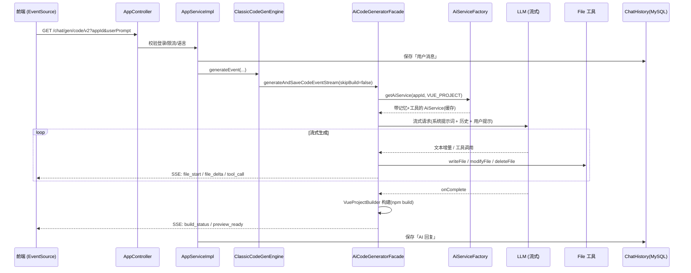

# AI Code Backend（AI 应用代码生成平台 · 后端）

基于 **Spring Boot 3.5 + LangChain4j + LangGraph4j** 构建的 AI 应用代码生成平台后端。用户用一句自然语言描述需求，平台即可自动**规划 → 路由 → 生成 → 校验 → 构建 → 部署**出一个可访问的网站/应用，并通过 SSE 流式实时返回生成过程。

> 类似 "bolt.new / v0 / 文心快码" 的能力：输入提示词，AI 实时生成 HTML 单页、多文件原生项目或完整 Vue 工程。

> 🌐 English version: [README.en.md](README.en.md)

---

## 目录

- [核心特性](#核心特性)
- [技术栈](#技术栈)
- [⭐ AI 生成应用整体流程图](#-ai-生成应用整体流程图)
- [两种生成模式](#两种生成模式classic-vs-workflow)
- [三种代码生成类型](#三种代码生成类型)
- [核心组件说明](#核心组件说明)
- [快速开始](#快速开始)
- [主要接口](#主要接口)
- [目录结构](#目录结构)

---

## 核心特性

- 🤖 **自然语言生成应用**：一句话生成 HTML / 多文件 / Vue 工程，全程 SSE 流式输出。
- 🧭 **智能路由**：AI 自动判断「生成类型」（HTML / 多文件 / Vue）与「生成模式」（标准 / 工作流）。
- 🔧 **工具调用 (Tool Use)**：Vue 工程模式下，AI 通过 `writeFile / modifyFile / deleteFile / readFile` 等工具自主操作文件系统。
- 🕸️ **LangGraph4j 工作流编排**：图片采集 → 提示词增强 → 代码生成 → 质量检查（失败自动重试）→ 项目构建。
- 🖼️ **素材自动采集**：并行从 Pexels（配图）、unDraw（插画）、Logo.dev（Logo）、Mermaid（图表）收集素材并注入提示词。
- ✅ **AI 代码质量检查**：生成后由 AI 复查代码，不合格则携带错误信息回环重新生成。
- 🚀 **一键部署 + 自动截图**：构建产物部署为可访问站点，异步用 Selenium 截图并上传 R2 作为封面。
- 💬 **多轮对话记忆**：基于 Redis 的会话记忆（按 appId 隔离），支持对已生成应用持续迭代修改。
- 🛡️ **安全与限流**：输入安全护栏（Guardrail）、Redisson 分布式限流、`@AuthCheck` 权限校验。
- 🌍 **多语言**：根据用户输入语言（中/英）自动调整 AI 输出语言。

---

## 技术栈

| 分类 | 技术 |
| --- | --- |
| 框架 | Spring Boot 3.5.13、Java 25 |
| AI 编排 | LangChain4j 1.13、LangGraph4j 1.8（工作流图） |
| 大模型 | OpenAI 兼容协议（默认接入 DeepSeek / Gemini，可配置） |
| 流式 | Reactor `Flux` + Server-Sent Events (SSE) |
| 持久化 | MySQL + MyBatis-Flex |
| 缓存/会话/记忆 | Redis（Spring Session、Chat Memory）、Caffeine（AiService 实例缓存） |
| 限流/锁 | Redisson |
| 对象存储 | Cloudflare R2（AWS S3 SDK） |
| 截图 | Selenium + WebDriverManager |
| 接口文档 | Knife4j (OpenAPI 3) |

---

## ⭐ AI 生成应用整体流程图

> 这是平台最核心的链路：从「用户发送一句提示词」到「代码生成落盘并流式返回前端」。

```mermaid
flowchart TD
    A([用户发送提示词<br/>GET /app/chat/gen/code/v2]) --> B[AppController<br/>权限校验 / 限流 / 语言识别]
    B --> C[AppServiceImpl.chatToGenCodeV2<br/>加载 App、保存用户消息到历史]
    C --> D{选择生成模式<br/>AiCodeGenModeRoutingService}
    D -->|classic| E[ClassicCodeGenEngine]
    D -->|workflow| F[WorkflowCodeGenEngine]

    %% ---------- 标准模式 ----------
    E --> G[AiCodeGeneratorFacade<br/>按生成类型分发]
    G --> H[AiCodeGenerateServiceFactory<br/>取/建带记忆的 AiService<br/>Caffeine 缓存 + Redis 记忆]
    H --> I{代码生成类型}
    I -->|HTML / MULTI_FILE| J[流式文本生成<br/>FileBlockStreamParser 解析文件块]
    I -->|VUE_PROJECT| K[TokenStream + 工具调用<br/>writeFile/modifyFile/deleteFile]

    %% ---------- 工作流模式 ----------
    F --> L[CodeGenWorkflow<br/>LangGraph4j 图执行]
    L --> M[ImageCollectorNode<br/>并行采集图片素材]
    M --> N[PromptEnhancerNode<br/>注入素材，增强提示词]
    N --> O[RouterNode<br/>AI 判定生成类型]
    O --> P[CodeGeneratorNode<br/>调用 Facade 生成<br/>skipBuild=true]
    P --> Q[CodeQualityCheckNode<br/>AI 代码质量检查]
    Q -->|不合格 fail| P
    Q -->|HTML/多文件 skip_build| END1
    Q -->|Vue build| R[ProjectBuilderNode<br/>npm install & npm run build]
    R --> END1

    %% ---------- 汇聚：落盘与流式 ----------
    J --> S[AppFileService<br/>写入 CODE_OUTPUT/{type}_{appId}/]
    K --> S
    END1 --> S
    S --> T[StreamHandlerExecutor<br/>收集 AI 回复并存入对话历史]
    T --> U([SSE 流式事件返回前端<br/>file_start / file_delta / file_done<br/>tool_call / build_status / preview_ready])

    %% ---------- 后续动作 ----------
    U -.可选.-> V[/app/deploy<br/>构建产物部署为站点/]
    V -.异步.-> W[ScreenshotService<br/>Selenium 截图 → 上传 R2 → 更新封面]
```

### 时序视角（标准模式 · 以 Vue 工程为例）



---

## 两种生成模式（CLASSIC vs WORKFLOW）

模式由 `AiCodeGenModeRoutingService`（AI 判定）或请求参数 `mode` 决定。

| 维度 | CLASSIC（标准模式） | WORKFLOW（工作流模式） |
| --- | --- | --- |
| 编排 | 单次 AiService 调用 | LangGraph4j 多节点图编排 |
| 前置处理 | 无 | 图片采集 + 提示词增强 |
| 生成类型路由 | 沿用 App 既定类型 | `RouterNode` 由 AI 判定 |
| 质量控制 | 无 | `CodeQualityCheckNode`，失败回环重生成 |
| 构建时机 | 生成完立即构建 | `ProjectBuilderNode` 条件构建 |
| 适用场景 | 快速生成 / 迭代修改 | 复杂、需配图与质量保障的首次生成 |

工作流图的关键回环逻辑见 `CodeGenWorkflow#routeAfterQualityCheck`：质量检查不通过 → 携带错误信息回到 `CodeGeneratorNode` 重新生成。

---

## 三种代码生成类型

由 `AiCodeGenTypeRoutingService` 在建应用时 AI 判定，枚举见 `CodeGenTypeEnum`。

| 类型 | 值 | 说明 | 生成方式 |
| --- | --- | --- | --- |
| `HTML` | `html` | 原生单 HTML 页面 | 流式文本，`HtmlCodeParser` 解析 |
| `MULTI_FILE` | `multi_file` | 原生多文件（HTML/CSS/JS） | 流式文本，`FileBlockStreamParser` / `MultiFileCodeParser` |
| `VUE_PROJECT` | `vue_project` | 完整 Vue 工程 | `TokenStream` + 文件工具调用 + `npm build` |

---

## 核心组件说明

| 组件 | 路径 | 职责 |
| --- | --- | --- |
| `AppController` | `controller/AppController.java` | 生成入口（`/chat/gen/code`、`/chat/gen/code/v2`）、部署、文件、下载 |
| `AppServiceImpl` | `service/impl/AppServiceImpl.java` | 编排：校验、选模式/引擎、存历史、收集结果 |
| `CodeGenEngine` | `core/engine/` | 引擎接口；`Classic` / `Workflow` 两种实现 |
| `AiCodeGeneratorFacade` | `core/AiCodeGeneratorFacade.java` | 按类型分发到对应 AiService，处理流式/工具流与落盘 |
| `AiCodeGenerateService(Factory)` | `ai/` | LangChain4j `@AiService` 接口；工厂负责按 appId 缓存实例、加载 Redis 记忆、装配工具与护栏 |
| 路由服务 | `ai/AiCodeGenTypeRoutingService`、`AiCodeGenModeRoutingService` | AI 判定生成类型 / 生成模式 |
| 文件工具 | `ai/tools/` | `FileWrite/Modify/Delete/Read/DirRead/Exit`，供 Vue 模式工具调用 |
| 护栏 | `ai/guardrail/` | `PromptSafetyInputGuardrail` 输入安全、`RetryOutputGuardrail` 输出重试 |
| 工作流 | `langgraph4j/CodeGenWorkflow.java` | LangGraph4j 图定义与执行（含并发版 `CodeGenConcurrentWorkflow`） |
| 工作流节点 | `langgraph4j/node/` | `ImageCollector / PromptEnhancer / Router / CodeGenerator / CodeQualityCheck / ProjectBuilder` |
| 工作流状态 | `langgraph4j/state/WorkflowContext.java` | 节点间共享上下文（提示词、类型、目录、质检结果、流回调等） |
| 流处理 | `core/handler/`、`core/parser/` | 流式事件解析、文件块解析、历史收集 |
| 构建 | `core/builder/VueProjectBuilder.java` | 执行 `npm install && npm run build` |
| 部署/截图/存储 | `service/`、`manager/R2StorageManger.java` | 部署站点、Selenium 截图、R2 上传 |
| 限流 | `ratelimiter/` | `@RateLimit` + Redisson |

提示词模板集中在 `src/main/resources/prompt/`（按生成类型、路由、质检、图片采集分别维护）。

---

## 快速开始

### 1. 环境要求

- JDK **25**
- Maven 3.9+（或使用自带的 `./mvnw`）
- MySQL 8.x、Redis 6+
- Node.js（生成 Vue 工程并构建时需要 `npm`）
- 一个 OpenAI 兼容的大模型 API（默认配置接入 DeepSeek / Gemini）

### 2. 初始化数据库

```bash
mysql -u root -p < sql/create_table.sql
```

### 3. 配置

激活的 profile 默认为 `local`（见 `application.yml`）。请在 `src/main/resources/application-local.yml` 中填入你自己的配置（**切勿将真实密钥提交到仓库**）：

- `spring.datasource.*`：MySQL 连接
- `spring.data.redis.*`：Redis 连接
- `langchain4j.open-ai.*`：三个模型端点
  - `chat-model`：HTML/多文件的对话模型
  - `streaming-chat-model`：流式生成模型
  - `reasoning-streaming-chat-model`：Vue 工程使用的推理模型
- `cloudflare.r2.*`：对象存储（截图/封面）
- `pexels` / `logoDev`：图片与 Logo 素材 API Key
- `code.deploy-host`：部署站点访问域名

### 4. 启动

```bash
./mvnw spring-boot:run
```

- 服务端口：`8123`，上下文路径：`/api`
- 接口文档（Knife4j）：http://localhost:8123/api/doc.html

---

## 主要接口

服务前缀：`/api`，控制器前缀见各注解。

### 应用与生成（`/app`）

| 方法 | 路径 | 说明 |
| --- | --- | --- |
| GET | `/app/chat/gen/code` | v1：生成代码，SSE 返回**原始代码流**（限流 2 次/60s） |
| GET | `/app/chat/gen/code/v2` | v2：生成代码，SSE 返回**结构化事件**（推荐，自动选模式） |
| POST | `/app/add` | 创建应用（AI 同时生成应用名与路由类型） |
| POST | `/app/deploy` | 部署应用，返回访问地址 |
| GET | `/app/files/{appId}` | 查看生成的文件树 |
| GET | `/app/download/{appId}` | 下载生成的项目 |
| POST | `/app/my/list/page/vo` | 我的应用分页 |
| POST | `/app/good/list/page/vo` | 精选应用分页 |

### 其他

| 模块 | 前缀 | 说明 |
| --- | --- | --- |
| 用户 | `/users` | 注册、登录、登出、信息维护 |
| 对话历史 | `/chatHistory` | 按 appId 查询对话历史 |
| 静态资源 | `/static/{deployKey}/**` | 已部署应用的访问入口 |
| 工作流调试 | `/workflow` | 工作流执行的 SSE/Flux 调试接口 |
| 健康检查 | `/health` | 存活探针 |

> v2 事件类型包括：`assistant_message`、`file_start` / `file_delta` / `file_done`、`tool_call`、`build_status`、`preview_ready`、`generation_error` 等（见 `ai/model/message/`）。

---

## 目录结构

```
src/main/java/dev/jingtao/aicodebackend/
├── AiCodeBackendApplication.java   # 启动类
├── controller/                     # HTTP 入口（App / Users / ChatHistory / Workflow ...）
├── service/                        # 业务服务（App / ChatHistory / AppFile / Screenshot / Download）
├── core/                           # 生成核心
│   ├── AiCodeGeneratorFacade.java  #   按类型分发的门面
│   ├── engine/                     #   Classic / Workflow 两种引擎
│   ├── handler/ & parser/          #   流式事件处理与代码解析
│   └── builder/                    #   Vue 工程构建
├── ai/                             # LangChain4j AiService、工厂、工具、护栏、路由
│   ├── tools/                      #   文件读写等工具（Tool Use）
│   └── guardrail/                  #   输入/输出护栏
├── langgraph4j/                    # LangGraph4j 工作流
│   ├── CodeGenWorkflow.java        #   图定义与执行
│   ├── node/ (+ concurrent/)       #   各编排节点
│   ├── state/                      #   WorkflowContext 共享状态
│   ├── ai/ & tools/                #   图片采集、质检等服务与工具
├── ratelimiter/                    # Redisson 限流（注解 + 切面）
├── manager/                        # R2 对象存储
├── model/                          # entity / dto / vo / enums
├── config/                         # Redis / S3 / 模型 / CORS / i18n 等配置
└── exception/                      # 全局异常与错误码

src/main/resources/
├── application*.yml                # 配置（local / prod）
├── prompt/                         # 各类系统提示词模板
└── mapper/                         # MyBatis 映射

sql/create_table.sql               # 建表脚本
```

---

> 注：`application-local.yml` 含敏感密钥，已在 `.gitignore` 范畴内管理，请勿提交真实凭证。
